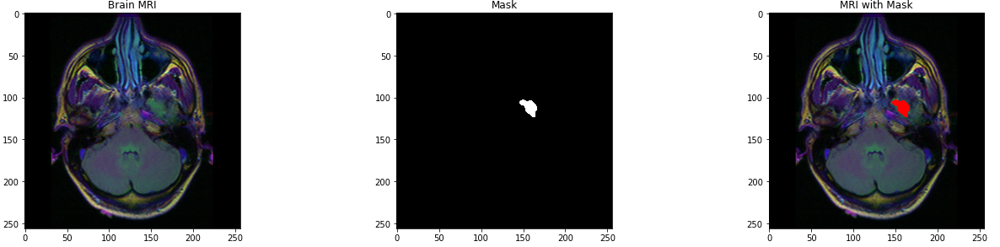
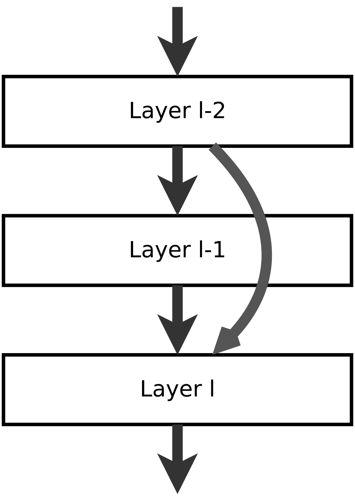

# Portfolio

On this page I demosntrate some of the projects I have been working on. All the projects are related to Data Science, Machine Learning and different AI topics.

---

# ResUnet - Segmentation

In this notebook I am exploring segmentation and classification techniques on MRI dataset. This dataset contains images with healthy and cancerous brains with respective labeling and corresponding mask images. 

Above on the first image the MRI image of cancerous brain is plotted, on the second image the mask of the corresponding image is shown which is later superposed on the first image to highlight the cancer part. 

For classification, to detect which image is of either healthy or cancerous brain, ResNet is deployed. As for segmentation part a very famous architechture ResUnet is used. It is based on Unet architecture which is famous for its high performance in segmentation. The results are evaluated and an example is given below

---

## ResNet - Detection and Classification

In this notebook I explore some deep learning techniques for detection and classification purposes. The dataset consists of some image pixels and 15 different key points for each image. The dataset is used to train ResNet for detecting the keypoints. 

ResNet is a very powerful architecture which exploits the identity mappings on top of CNN and by using skipping connections property it deals with the impacts of vanishing gradients.

     

In the second part another dataset is used which contains images of different emotions with labels. In this case ResNet is used for classification. Finally both architechtures are combined to detect keypoints and then classify the images according to different expressions. The results are plotted below

---

## Image Denoising using Convolutional Autoencoders (CAE)

In this notebook I've used Convolutional Autoencoders to denoise MNIST image data, as well as deployed simple CNN for classification.
Firstly the noise has been added to the image data and afterwards it has been reconstructed by using CAE. 

CNN achieved the accuracy of 0,99.

After applying CAE to noisy MNIST data we get well recovered/denoised images,which is shown below

---
## Computer Vision: Counting Fingers using Convex Hull

In this notebook we are using Convex Hull algorithm from OpenCv to count fingers. 

First of all we choose the region of interest which will be used as a background and where the hand will be positioned. We threshold it so we can grab a foreground. Afterwards when the hand is positioned in the roi, we segment it using convex hull. It looks something like the following

  

After that we find the maximum euclidean distance between the center of the palm and the most extreme points of the convex hull, later it will be used to create a circle with 80% radius of the max euclidean distance between center point and outermost points. And finally we loop through the contours to see if we count any more fingers.

The results are given below. Altough it works fine, the method is not robust to noise.

    

---

## Kaggle: Titanic - Classification Problem

In this notebook we perform some data analysis on Titanic dataset provided on Kaggle. 

The objective of this task is to predict the survival rate of passengers. It's clearly a classification probem, thus we can use several machine learning or deep learning techniques to tackle this problem. In this case I am using typical machine learning technics such as: Support Vector Machines, KNN, Logistic Regression, Random Forest, Naive Bayes, Linear SVC, Decision Tree. Before applying the ML techniques to data first it is necessary to perform some data preprocessing to unfold some correlations between different features, including some feature removal or creating some additional more descriptive features. 

By plotting data we can check some dependencies that is neccasarry to know in order to evaluate which features we need to prioritize and which ones to ignore. Below for example is given the clear dependancy between age and survivale rate

By uncovering such dependencies we can transform data, for example in case of age feature instead of continous data we can select the age range that is more or less likely to survive. 

After the preprocessing now the above mentioned machine learning techniques are applied to predict the results. Accuracy scores of each technique is given below

---

## Generative Adversarial Network (GAN)

In this notebook I explore Generative Adversarial Networks (GAN). As for a training data MNIST's fashion dataset is used to train the model in unsupervided manner in order to generate the fake images which look like the real ones. The architecture of GNA model consists of two major blocks - generator and discriminator, which compete in an ersatz game where one's gain is another's loss. The generator generates a random data which is fed to discriminator whose job is to differentiate the fake data from an original data. The result is then backpropagated to generator which tries to minimiwe the error in order to fool the discriminator into believing that it is a real data. 

While the model is being trained for each second epoch the results are plotted to track the progress. On the image given below there's a clear improvement of the generated data, we can clearly see that the images on the second plot are very similar to original images from Mnist fashion dataset. On the first image the results from earlier epoch are given, while on the second one the results from final train are demonstrated.

 

---

# Kaggle: Disaster tweets analysis - NLP problem

In this notebook I explore some NLP techniques using Disaster tweets data provided on Kaggle. Dataset contains more than 7 thousand tweets among which some are about disaster and some are not. The goal is to explore data and find the best performing algoritm that can classify new data into disaster and not-disaster categories.

First of all some data exploration needs to be done to learn more about data. For example below it is demonstrated what words are repetead in tweets at what frequency. 

Afterwards some preprocessing is being applied to remove from tweets unnecessary words or punctuation. This step makes it easier for algorithms to process the data and extract only relevant information from tweets. Then scikit-learn's CountVectorizer is uded to count the words in each tweet and turn them into data that algorithms can process.

Finally some classification algorithms are applied such as Ridge Classifier and Naive Bayes to predict the classes, where ridge classifier showed high performance.

---

## Kaggle: Customers Clustering Problem + PCA

In this notebook I explore clustering techniques for mall customers analysis. Before applying any clustering some exploratory data analysis is performed to explore dataset closely. While performing EDA one can notice that some of the data is not normally distributed. To check it one can perform hypothesis testing. Plotting the results it is obvious that data is not normally distributed and that the null hypothesis can be rejected. 

Given that Kmeans, for example, assumes that the data is normally distributed it is suggested to transform data to fit the desired distribution. After performing all the neccessary data preprocessing, now it is time to apply some clustering techniques such as Kmeans and Hierarchical Clustering. To be able to plot the results one has to perform some dimentionality reduction and reduce the number of features by combining them into new features that share similarities. Finally results are plotted in 3D space where we can clearly see the uncovered 6 clusters from the data.

 

---

## Variational Autoencoders (VAE)

In this notebook I explore variational Autoencoders (VAE) with Mnist's fashion dataset. Variational autoencoders are meant to compress the input information into a constrained multivariate latent distribution (encoding) to reconstruct it as accurately as possible (decoding). 

So the model learns the dataset which contains images of different clothes. The objective is to reconstruct the image using mean and variance of desired output. Two different loss functions are used which is finally combined into one total loss function. The results of some of the reconstructed images are given below

If we want to reconstruct an image of a particular piece of clothes than we can first enocode the respective image to get the values of mean and variance, and using these values later it is possible to decode it and reconstruct and image. The result is given below.

---

## Kaggle: USA_Housing - Regression Problem

In this notebook we perform some data analysis on USA_Housing dataset provided on Kaggle. This is clearly a regression problem where we are supposed to predict the cantinuous value of the house price. 

Before applying any machine learning technique, first data is analysed and preprossed. In the data there is no missing value which makes it so much easier to preprocess the data. In addition to that there are only 6 independent variable among which is an address feature. The pnly useful information that we can subtract from the address feature is the State. 

The best way to quickly evaluate some dependencies between features is to plot the heatmap that show some correlations between data.

Finally several machine learning techniques have been tested to predict the prices. The performance is evaluated by using R-squared and the results are given below.

---

## Q-learning - Reinforcement learning 

In this project I explore Q-learning for optimizing warehouse flows. We are given a task to find the shortest path from one point to another in a grid given below.

To solve this task a reinforcement technique is used. Q-learning is based on Markov's decision processes. Here the problem is solved in three steps, where in the first place environment is defined, then Q-learning algorithm is implemented and finally it is put into a production. We can also define an intermidiary point where the robot needs to pass before reaching the destination. 

Q-learning is a model-free reinforcement learning algorithm this means it can handle problems with stochastic transitions and rewards without requiring adaptations. 

