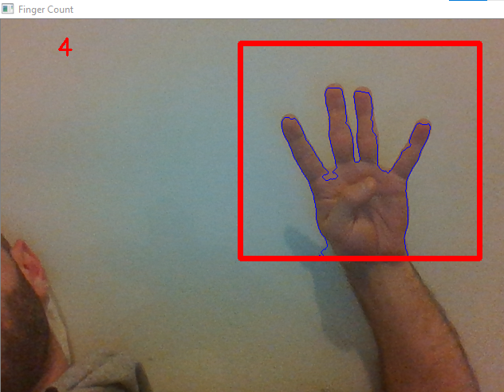

# Portfolio

On this page I demosntrate some of the projects I have been working on. All the projects are related to Data Science, Machine Learning and different AI topics.

---
## Image Denoising using Convolutional Autoencoders

In this notebook I've used Convolutional Autoencoders to denoise MNIST image data, as well as deployed simple CNN for classification.
Firstly the noise has been added to the image data and afterwards it has been reconstructed by using CAE. 

CNN achieved the accuracy of 0,99.

After applying CAE to noisy MNIST data we get well recovered/denoised images,which is shown below

---
## Counting Fingers using Convex Hull

In this notebook we are using Convex Hull algorithm from OpenCv to count fingers. 
This is a capstone project of the udemy course developed by Jose Portilla.

First of all we choose the region of interest which will be used as a background and where the hand will be positioned. We threshold it so we can grab a foreground. Afterwards when the hand is positioned in the roi, we segment it using convex hull. It looks something like the following

  

After that we find the maximum euclidean distance between the center of the palm and the most extreme points of the convex hull, later it will be used to create a circle with 80% radius of the max euclidean distance between center point and outermost points. And finally we loop through the contours to see if we count any more fingers.

The results are given below. Remark: this method is not robust and quite sensitive to noise, nevertheless it is the simpless method to tackle the subject. 

    
